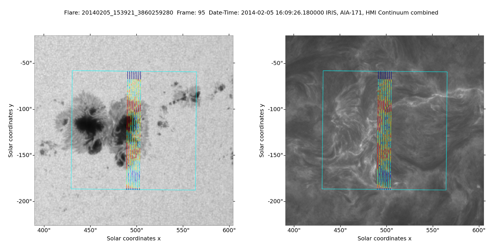

# IRIS_AIA_HMI_align
This repository provides some functions collected from sunpy and irispy to align images between IRIS, AIA and HMI, and plot slit information from IRIS on top of oneanother. An example for the HMI continuum background and the AIA filter 304 \AA
is provided below:

